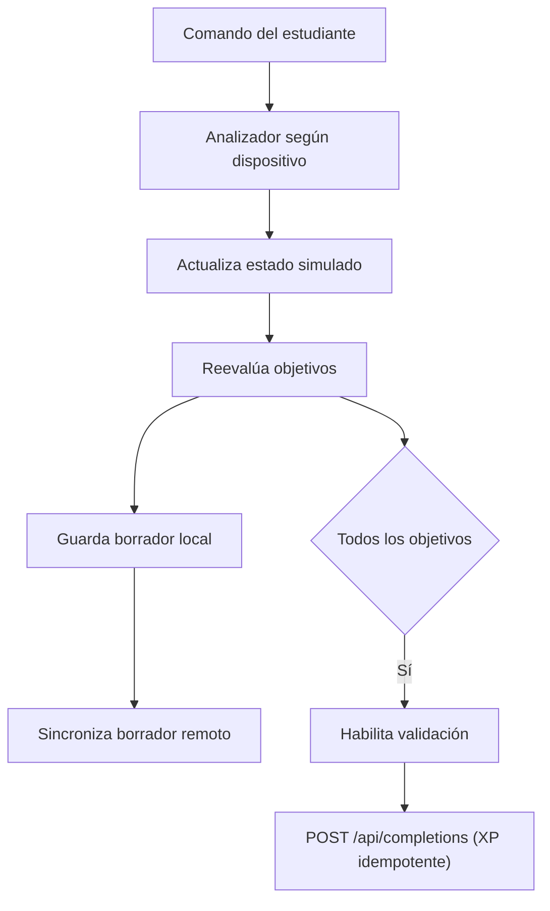

# Arquitectura

## Capas

| Capa | Responsabilidad | Implementación actual |
|---|---|---|
| Presentación | Inicio, unidades, terminales, objetivos y diálogos | `dist/index.html`, `dist/styles.css` |
| Dominio educativo | Laboratorios, estados iniciales, objetivos y desbloqueo | `LABS`, `U2_LABS`, `U3_LABS`, `BADGES` en `dist/app.js` |
| Simulador | Modos IOS, comandos, VLAN, interfaces, PC y ping | Núcleo IOS `executeIosCommon`, motor PC `executeVirtualPc` y capacidades por unidad |
| Acceso | SSO desde la tarjeta de AulaSimple, login con credenciales de la plataforma, sesión y cierre | `initAuth` en `dist/app.js`; `server/auth.js` (`/api/sso`, `/api/login`, `/api/me`, `/api/logout`) |
| Progreso | Intentos, ayudas, XP, insignias, porcentaje y ranking | `completedLabs`, `learner`, `awardRemote` |
| Persistencia local | Sesión, perfil y borradores inmediatos | `localStorage` |
| Persistencia remota | Perfil, finalizaciones, borradores y ranking | API propia (`apiRequest` → `/api`, `server/labs.js`) sobre SQLite (`server/db.js`) |
| Publicación | Servicio Node que sirve `dist/` y la API | `server/index.js` y `Dockerfile`, desplegado en EasyPanel |

## Flujo de una acción

## Estado de U1

`initialState()` contiene SW1, PC1, PC2, configuración de inicio, último ping e historial. Los seis laboratorios viven en `LABS`. Algunos laboratorios preservan el estado de la misión anterior; el integrador comienza limpio.

## Estado de U2

`initialU2State()` contiene SW1, SW2, PC1, PC2, observaciones de comandos `show` e historiales independientes por dispositivo. Cada switch posee VLAN, interfaces, modos y startup-config propios. Los seis laboratorios viven en `U2_LABS`.

## Estado de U3

`initialU3State()` contiene SW1, R1, PC1 y PC2. El switch mantiene tres puertos; el router mantiene G0/0 y sus subinterfaces dinámicas. Cada equipo IOS conserva modo, contexto, running-config, startup-config e historial propios. Los seis laboratorios viven en `U3_LABS`.

## Capacidades compartidas actuales

- `defineUnit`: normaliza cada definición y calcula el final de su rango de progreso.
- `validateUnitCatalog`: comprueba esquema, unicidad y ausencia de superposición antes de iniciar.
- `unitHasCapability`: permite que motores y ayudas activen comportamiento desde el contrato, sin depender del número de unidad.
- `iosPrompt`: genera el prompt de PC o switch según dispositivo y modo.
- `executeVirtualPc`: interpreta ayuda, IPv4, máscara/prefijo, gateway, DNS, limpieza y ping.
- `executeIosCommon`: interpreta modos, navegación, VLAN, interfaces, descripción, estado administrativo, comandos `show` y startup-config.
- `writeIosVlan`, `writeIosInterfaces`, `writeIosTrunk`, `writeIosSwitchport` y `writeIosRun`: generan las salidas IOS compartidas.
- Las opciones `full` y `trunkDetails` permiten conservar una salida extensa en U1 y mostrar VLAN permitidas/nativa en U2 sin duplicar renderizadores.
- `evaluateLabGoals` y `updateLabWorkspace`: calculan objetivos, controlan el botón de validación y anuncian el estado listo.
- `renderUnitLabList`: genera porcentaje, contador, bloqueo y estado de cada laboratorio desde `UNIT_CATALOG`.
- `setLabMissionContent` y `showLabInstructions`: cargan los textos de misión e instrucciones para cualquier unidad.
- `loadLabSession`: coordina desbloqueo, preparación de topología, captura del estado inicial, restauración y apertura del dispositivo.
- `resetLabSession`: restaura una copia limpia, registra el intento, limpia el estado visual y vuelve a guardar.
- Cada unidad inyecta su evaluación de conectividad; U1 considera puertos y VLAN locales, U2 añade los dos switches y el trunk, y U3 valida trunk, encapsulación dot1Q, gateways y rutas entre subredes.
- U2 conserva una extensión pequeña para VLAN permitidas y VLAN nativa en enlaces trunk.
- El controlador común de terminal administra Enter, historial, foco y limpieza.

## Contrato del catálogo

`UNIT_CATALOG` es la fuente de verdad para identidad, dispositivos, capacidades, laboratorios, rango de progreso, insignia y adaptadores de navegación. U1 conserva los índices 0–5, U2 los índices 6–11 y U3 los índices 12–17; los rangos ya no dependen de constantes duplicadas.

`COURSE_CATALOG` agrupa unidades publicadas por proveedor, curso, versión de examen y módulo. La ruta activa controla las tarjetas y la continuidad; XP, ranking e insignias siguen siendo globales entre rutas. El selector aparece cuando hay más de un curso publicado. Cada sesión registrada declara vista, dialecto y métodos de guardado, restauración, reinicio y enfoque; agregar un proveedor requiere implementar su propio intérprete (FortiOS no se deriva de IOS).

La creación concreta de cada topología todavía se implementa mediante adaptadores de U1, U2 y U3. Este límite permite agregar una unidad a la vez sin modificar progreso ni XP existentes.

`published_labs` restringe `POST /api/completions` a índices realmente publicados. `lab_drafts` almacena un borrador remoto por laboratorio y usuario. No existen cursos CCNP o NSE 4 publicados todavía.

## Deuda técnica relevante

Al agregar más unidades, el objetivo es terminar de separar:

- motor compartido: comandos, modos, guardado, historial, XP y diálogos;
- definición de unidad: dispositivos, estado inicial, laboratorios, objetivos y textos;
- capacidades: por ejemplo `trunk`, `routing`, `stp` o `dhcp`.

## Fuente de verdad

- Identidad: la plataforma AulaSimple valida las credenciales y el token de la tarjeta (el administrador de prueba se valida con variables del servidor); dentro de la app, el correo normalizado identifica a la persona, entre por SSO, por login o como administrador de prueba.
- Usuario autenticado: la base SQLite del servidor es la fuente de verdad para XP y finalizaciones; `POST /api/completions` calcula y entrega el XP.
- Trabajo en curso: guardado local inmediato más un borrador remoto con retardo.
- Estado visual: se vuelve a calcular desde las finalizaciones sincronizadas.
- Invitado: puede explorar, pero debe iniciar sesión para registrar XP.
